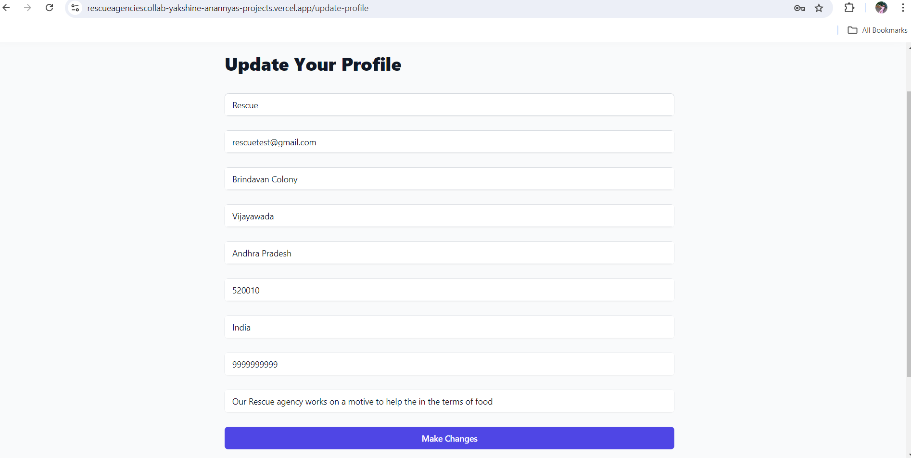

# RescueCollab - An Rescue Agency Collaboration Application

RescueCollab was developed by Team Innov8ors as a part of the Smart India Internal Hackathon (SIH) 2023.

**Deployed Link:** [https://rescueagenciescollab-yakshine-anannyas-projects.vercel.app/](https://rescueagenciescollab-yakshine-anannyas-projects.vercel.app/)

## Problem Statement Details

- **PS ID:** 1440
- **PS Title:** An application under which all rescue agencies are registered and which can display the location of other rescue relief agencies during natural/man-made calamities.
- **Organization:** Ministry of Home Affairs
- **Category:** Software
- **Domain:** Disaster Management

## PS Description

To build such an application, there is a need to create a central database where all rescue agencies can register their information, including their location, contact details, and areas of expertise. This information could be entered manually by agency administrators or automated using GPS or other location tracking technologies.


Once the database is populated, the application is designed to display this information in an easy-to-use interface. It includes:

- Filters that allow users to narrow down the results based on specific criteria, such as the type of disaster, the resources available, or the time since the last reported activity.
- - A map that shows the locations of all registered rescue agencies.


In addition to displaying the locations of rescue agencies, the application includes features for communication and collaboration:

- Agencies can send alerts or requests for assistance to each other directly through the application.
- Collaborate on shared resources such as medical equipment or transportation.

Security and privacy are major considerations in building this application:

- Ensuring that only authorized users have access to the database.
- Protecting sensitive information such as personal contact details.

Overall, RescueCollab aims to coordinate rescue agencies' efforts and provide aid more effectively during natural or man-made disasters.
### Application Screenshots

#### Landing Page


#### Agency Signup


#### Agency Login


#### Agency can view and update their profile details.




#### Agency can view and create the disaster details,displayed to all regsitered agencies.


#### Agency can view and create the Resource details,displayed to all regsitered agencies.


#### Agency can view and create the Alerts,displayed to all regsitered agencies.


#### Contact Page


#### Logout


## Tech Stack

- **Frontend:** React.js
- **Backend:** Node.js, Express.js
- **Database:** MongoDB
- **Mapping:** Mapbox API

## Project Setup

### Prerequisites

- Node.js
- MongoDB
- Mapbox API Key

### Installation

1. Clone the repository:

   ```bash
   git clone https://github.com/YakshineAnannyaGudapati/RescueCollab_sih.git
   cd RescueCollab_sih
   ```

2. Install dependencies for the backend:

   ```bash
   cd Backend
   npm install
   ```

3. Install dependencies for the frontend:

   ```bash
   cd ../Frontend
   npm install
   ```

### Configuration

1. Create a .env file in backend with the following details:
MONGO_URL=
NODE_ENV=
PORT=
MAPBOX_API_KEY=
JWT_SECRET=
SALTROUNDES=


### Running the Application

1. Start the backend server:

   ```bash
   cd Backend
   npm start
   ```

2. Start the frontend server:

   ```bash
   cd Frontend
   npm start
   ```

### Usage

Once the servers are running, open your browser and navigate to `http://localhost:3000` to access the application.

## Features

- Central database for rescue agencies' information.
- Interactive map displaying the location of rescue agencies.
- Filters to narrow down search results based on specific criteria.
- Communication and collaboration tools for agencies.
- Security and privacy measures to protect sensitive information.

## License

This project is licensed under the MIT License.

## Contact

For more information, please contact:

- **Email:** [yakshineanannya@gmail.com]
- **LinkedIn:** [YakshineAnannya](https://www.linkedin.com/in/yakshineanannya/)

---

Developed by Team Innov8ors.
